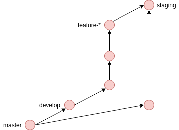
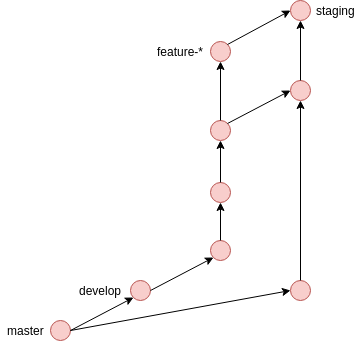
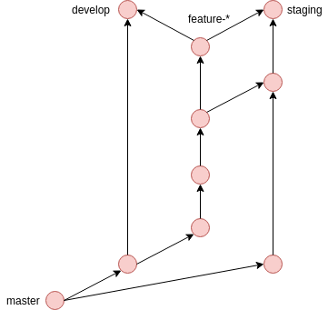
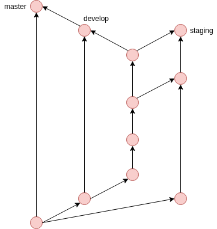

# git工作流
先介绍一下业务背景，我们的项目由四五个同学同步进行开发，难免会出现代码冲突，由此设计了这一套分支管理方案。该方案基于[git分支管理最佳实践](http://nvie.com/posts/a-successful-git-branching-model/)。

如有分支管理优化意见，欢迎**共同探讨**。

### 分支类型
* master
  - 主分支，提供发布的稳定版。
  - 仅限合并 develop、hotfix-\* 分支
* develop
  - 开发分支，提供最新的开发版。
  - 仅限合并 feature-\*、hotfix-\* 分支
* staging
  - 测试分支，提供最新的测试版。
  - 仅限合并 feature-\*、hotfix-\* 分支
* feature-\*
  - 特性分支或功能分支，用于开发具体需求。
  - 例如：feature-fds-bucket-list 文件存储的 bucket 列表开发。
* hotfix-\*
  - 热性分支，用于修复线上严重bug
  - 仅限合并 master、develop、staging 分支

### 生命周期

#### 开发
``` bash
# 基于 develop 创建新特性分支
git checkout -b feature-* develop
git add .
git commit -m "commit description"
# many commit...
```

图示：


#### 测试环境提测
``` bash
# 合并特性分支到 staging
git checkout staging
git pull origin staging  # 更新远程分支到本地
git merge feature-* --no-ff  # 如果有冲突，不确定保留哪部分，和相关同学确认
git push origin staging  # 每次提测，必须更新 origin/staging
```

单次提测图示：



**警告：** 相关 bug 回到原 feature-\* 分支进行修复，再次提测，**切勿在staging分支上进行bug修复**。多次提测图示：



#### 上线
**必须满足** 代码提测完成，达到稳定版本。**否则**不能将 feature-* 分支代码 merge 到 develop 分支上。

如需 code review，请提交一个 merge request，参考 [merge request 创建流程](http://v9.git.n.xiaomi.com/Eco_FE/Docs/blob/master/docs/code-review/code-review.md)。

图示：



#### 上线并确认无误
同步代码到主干分支，并且打上 tag。

``` bash
git checkout master
git pull origin master
git merge develop --no-ff
git tag -a v2.0.0 -m "tag description"  # 创建tag
git push origin master  # 更新 master
git push origin v2.0.0  # 同步 tag

# 上线后删除特性分支
git branch -D feature-*
```
图示：


